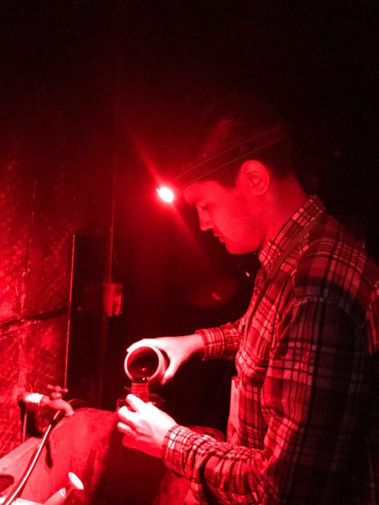

# About me
---
I knew from a young age that I wanted to be a zoologist. My parents, unable to obtain a higher education, therefore encouraged me to pursue my bachelor's degree in Zoology. While at university, I took exciting opportunities to work with plants, mice, shrews, frogs, flying squirrels, fruit flies, bats, and beavers! After graduating in 2018, I then moved to Ohio to begin my doctoral dissertation on the development and regulation of cooperative relationships in vampire bats.
  
  
As for more personal interests of mine, I really love listening to and talking about music, and recently I've been getting into digital illustration!
 
 
**Where to find me:**   
[razik.2@osu.edu](mailto:razik.2@osu.edu)  
[Twitter](https://twitter.com/irazik)  
[Google Scholar](https://scholar.google.com/citations?user=-YQ4T1YAAAAJ&hl=en)  
[ResearchGate](https://www.researchgate.net/profile/Imran_Razik)  
[ORCID](https://orcid.org/0000-0002-8529-6212)  

